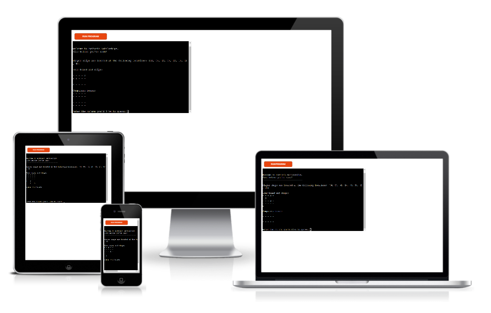

# Pythonic Battleships!

Pythonic Battleships is a simple easy to play Battleships game that is built within Python.
That game is set up on a 5x5 battlefield grid with both player and computer having 4 Battleships randomly deployed to the field.
The players goal is to find the location of and sink the computers Battleships, before the computer guesses the players.

[Here is a live version of my project](https://pythonic-battleships.herokuapp.com/)

----
##Contents
1. [How To Play](#How-To-Play "Goto Howto")

2. [Features](#Features "Goto Features")
  * [Current Features](#Current-Features "Goto Current Features")
  * [Future Features](#Future-Features "Goto Future Features")

3. [Testing](#Testing "Goto Testing")

4. [Deployment](#Deployment "Goto Deployment")

5. [Credits](#Credits "Goto Credits")

## How to Play

As stated above the goal of this game is to sink the opponents Battleships. When the game starts you will be presented with two
grids. Titled the players board and computers board accordingly. You will notice a difference in these two boards in that
the player board will have four "S" numbers placed in random locations. This indentifies the location of the players ships.
Don't worry though the computer does not know the location of these. The player will then be asked to guess a row and column, if
they get it correct that section of the board will update to an "X" to indicate a hit and the player will be informed they've
sank a battleship. If the player misses they will also be informed of said miss, however the location guessed will update to a
"O" instead of a "X" to indicate the miss. Once the player makes a guess the computer will then make a guess back at the players
board. This will also be updated to show the player where the computer has guessed.

-----

## Features

For a game like this there is a large number of features available that can be implemented. What I have done with this code is add features to make it a fun and functional game to play, however there are still some features I would like to implement in future.

### Current Features

- Random ship generation and placement.
  - Four ships will always be placed for both the player and computer. No one space can occupy two ships.
  

- Play against the computer which makes guesses back against the player.

- Accepts the location of wherever the user wants to guess.
  

- Validation prevents the computer from guessing the same location twice.
  

- Validation also prevents the user from inputting anything other than a valid integer or from guessing the same location twice.

  
  

### Future Features

Among the features I have already implemented there are two in particular that I would like to implement in future. The first feature I would like to implement in future is one in which the player before beggining the game can select the size of the board, size of the ships and number of ships to be played with. The second feature I would like to implement in future is one in which the user can also select the location they would like to place their own ships at.

----

## Testing

- Through testing as well as trial and error I was able to rid some bugs within my code that I was not imediately aware of.
When writing code to ensure the same location could not be selected twice it caused the player not to be able to select a 
location that the computer had guessed and vice versa. I was able to resolve this by seperating the players guesses from 
the computers guesses.
- Passed code through the PEP8 linter with no issues.
- Given invalid inputs, user is informed of why input is invalid and prompted to provide a valid input.

----

## Deployment

This project was deployed to Heroku.
- Steps for deployment.
  - Create a new Heroku app.
  - Set the buildbacks to Python and NodeJS in that order.
  - Link the Heroku app to the repository.
  - Click on Deploy.

  ----

## Credits

When I ran into issues in figuring out exactly I need to code what I wanted to there was a number or resources I used to help me.
- When creating my function that would place the ships I learned about "set()" from [GeeksforGeeks](https://www.geeksforgeeks.org/python-set-method/)
- When researching different methods about how I could maintain the value inputted by the user was an integer I came across this article on W3Schools refreshed me on ways you can check if a value is a string or integer for example. [W3Schools](https://www.w3schools.com/python/ref_string_isdigit.asp)
- [CodeInstitute](https://codeinstitute.net/ie/) for the tutorial on how to deploy my project.